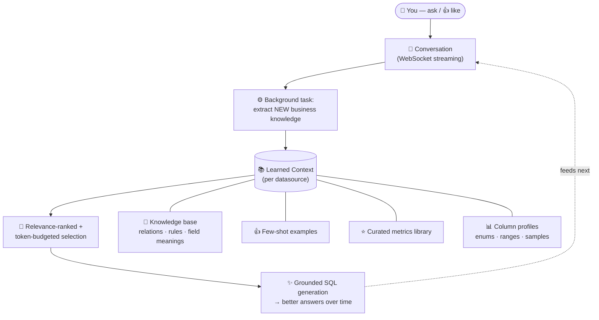
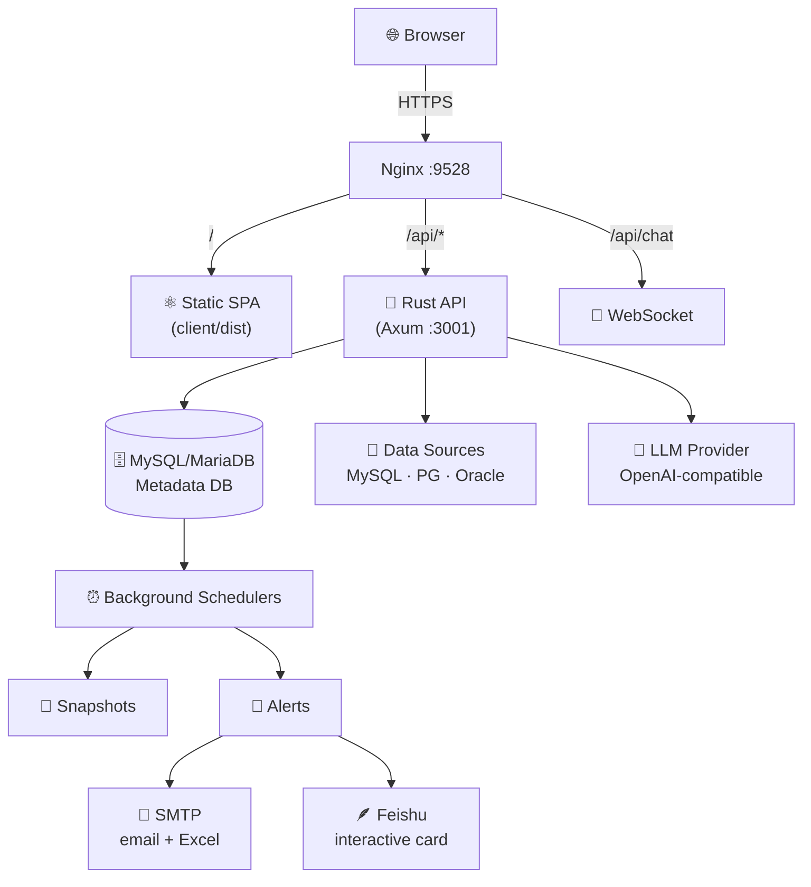

<div align="center">


# LingxiBI

**Connect databases. Talk to your data. Let AI build the dashboards.**

*灵犀 — intuitive understanding between you and your data.*

<br/>

[](https://github.com/bonfirer/ai-report/stargazers)
[](LICENSE)
[](https://www.rust-lang.org/)
[](https://react.dev/)
[](#-quick-start-with-docker-recommended)
[](CONTRIBUTING.md)
[](#-features)

<br/>

[🚀 Live Demo](#-live-demo) · [⚡ Quick Start](#-quick-start-with-docker-recommended) · [✨ Features](#-features) · [🧠 How It Learns](#-how-it-learns) · [🏗️ Architecture](#️-architecture) · [📦 Deploy](#-production-deployment)

<br/>

⭐ **If LingxiBI is useful to you, please [star it on GitHub](https://github.com/bonfirer/ai-report) — it really helps!**

<br/>

**English** · [简体中文](README.zh-CN.md)

</div>

---

## 💡 Overview

**LingxiBI** is a self-learning BI platform that turns raw databases into shareable, interactive dashboards — no SQL required, no traditional BI tool needed.

Connect MySQL, PostgreSQL, or Oracle, then:

1. **Ask in plain language** — the AI writes & executes read-only SQL.
2. **Curate a metrics library** — grounding the AI in your business definitions.
3. **Get smarter over time** — every conversation teaches the system your schema's business rules.
4. **Generate HTML dashboards** — refine them conversationally, with full version history.
5. **Stay informed** — threshold alerts via email (Excel attached) and/or Feishu interactive cards.

<br/>

<div align="center">
  
  <br/><sub>▲ AI-generated interactive dashboard with ECharts visualizations</sub>
</div>

<br/>

<div align="center">
  
  <br/><sub>▲ Natural language conversations with your data</sub>
</div>

---

## 🚀 Live demo

<table>
  <tr><td>🌐 <b>URL</b></td><td><a href="https://www.termiio.com:9528">https://www.termiio.com:9528</a></td></tr>
  <tr><td>👤 <b>Username</b></td><td><code>admin</code></td></tr>
  <tr><td>🔑 <b>Password</b></td><td><code>admin123</code></td></tr>
</table>

> ⚠️ Shared public demo — don't enter real credentials or sensitive data. Data may be reset periodically.

---

## ✨ Features

| | Capability | Description |
|---|---|---|
| 🔌 | **Multi-source connectivity** | MySQL · PostgreSQL · Oracle — auto-introspect schemas, visualize relationships as a knowledge graph |
| 💬 | **AI conversations** | Natural-language queries → read-only SQL, auto-fix, server-side streaming (survives navigation) |
| ⭐ | **Metrics library** | Named, validated business metrics — doubles as an AI knowledge base |
| 📊 | **AI dashboards** | One-prompt generation of responsive ECharts HTML dashboards, conversational refinement, version history + rollback |
| 🎨 | **Saved themes** | Save a report's visual style (colors, typography, chart styling) as a reusable theme, then generate new dashboards in that style with one click |
| 💡 | **AI data summary** | One-click narrative analysis of a report — headline, key findings, trends, anomalies & recommendations — grounded in the data, snapshot deltas, and your knowledge base (cached, regenerable) |
| 🧠 | **Self-learning** | Auto-extracts business knowledge per datasource; 👍'd answers become few-shot examples; relevance-ranked recall |
| 📸 | **Snapshots** | Scheduled metric snapshots for trend / YoY / MoM analysis |
| 🔔 | **Multi-channel alerts** | Threshold rules → AI-generated email (with Excel) and/or Feishu card (HMAC-SHA256 signed) |
| 🔗 | **Sharing** | Unguessable share links with publish/draft control |
| 🌍 | **i18n** | English + Chinese out of the box |
| 🔐 | **Security** | JWT auth, login rate-limiting, SQL allowlist validator, SSRF protection, security headers |

---

## 🧠 How it learns

Most text-to-SQL tools are stateless — they forget everything between questions. LingxiBI **accumulates per-datasource business knowledge** and feeds it back into every answer. The more your team uses it, the more accurate it becomes.



**Key mechanisms:**

- **Auto-extraction** — after each turn, the LLM distills only *new* knowledge (deduplicated, with confidence levels)
- **Human feedback** — 👍 saves Q&A pairs as few-shot examples for future queries
- **Curated metrics** — validated SQL with business-meaningful names, reused as trusted definitions
- **Smart recall** — ranked by keyword relevance × confidence, clamped to a token budget

---

## 🛠️ Tech stack

| Layer | Technology |
|-------|------------|
| 🦀 **Backend** | Rust · [Axum](https://github.com/tokio-rs/axum) · [SQLx](https://github.com/launchbadge/sqlx) · [Tokio](https://tokio.rs/) |
| 🗄️ **Metadata DB** | MySQL / MariaDB |
| 🎯 **Data sources** | MySQL · PostgreSQL · Oracle |
| 🤖 **LLM** | Any OpenAI-compatible API (DeepSeek, GPT-4o, Qwen, …) |
| 📧 **Delivery** | SMTP ([lettre](https://github.com/lettre/lettre)) · Excel ([rust_xlsxwriter](https://github.com/jmcnamara/rust_xlsxwriter)) · Feishu webhook (HMAC-SHA256) |
| ⚛️ **Frontend** | React 19 · Vite · TypeScript · Tailwind CSS · Zustand · React Router |

---

## 🏗️ Architecture



**Design principles:**

- **Stateless API** — only the metadata DB holds state; horizontally scalable
- **Atomic scheduling** — background jobs claim work atomically; safe for multi-instance
- **Multi-channel delivery** — each alert rule can target email, Feishu, or both; outcomes are recorded independently
- **Security-first** — SQL allowlist validator, SSRF guards on webhooks, bcrypt-12, security response headers

---

## ⚡ Quick start with Docker (recommended)

```bash
docker compose up -d --build
```

Open **http://localhost:9528** → create the first admin account. Done.

| Service | Role |
|---------|------|
| `db` | MySQL metadata store (internal only) |
| `server` | Rust API on `:3001` (auto-generates JWT_SECRET on first run) |
| `web` | Nginx on `:9528` — SPA + API proxy (incl. WebSocket) |

```bash
docker compose logs -f server     # follow API logs
docker compose down               # stop (preserves data)
docker compose down -v            # stop + wipe all data
```

> 🛡️ **Production:** set strong passwords in `.env`, set `CORS_ALLOWED_ORIGIN` to your real domain, and terminate TLS upstream.

---

## 💻 Local development

<details>
<summary><b>Prerequisites</b></summary>

- [Rust](https://rustup.rs/) (stable)
- [Node.js](https://nodejs.org/) ≥ 18
- MySQL or MariaDB

</details>

```bash
# 1. Create metadata database
mysql -e "CREATE DATABASE ai_report CHARACTER SET utf8mb4 COLLATE utf8mb4_unicode_ci;"

# 2. Start the API server
cd server
cp .env.example .env   # edit DATABASE_URL + JWT_SECRET
cargo run              # migrations auto-run, listening on :3001

# 3. Start the frontend
cd client
npm install && npm run dev   # Vite proxies /api → :3001
```

Open the printed URL, create admin, add a data source, configure your LLM in **Settings**.

---

## ⚙️ Configuration

| Variable | Description |
|----------|-------------|
| `DATABASE_URL` | Metadata DB connection string |
| `JWT_SECRET` | Auth token signing key (≥ 16 chars) |
| `CORS_ALLOWED_ORIGIN` | Allowed origin (`*` for dev only) |

> LLM provider, SMTP, and Feishu webhook are configured in-app at runtime (stored in DB, not env vars).

---

## 📦 Production deployment

```bash
# One-time server setup (Rust, MySQL, Nginx, TLS):
bash scripts/setup-server.sh [domain]

# Deploy from your machine:
./scripts/deploy.sh user@host [domain]
```

Rust binary is built on the target host (no glibc mismatch). SPA is built locally and served as static files.

> 💡 Docker Compose also works for production behind your own TLS proxy.

---

## 🗂️ Project structure

```
lingxibi/
├── client/                  React + Vite SPA
│   └── src/
│       ├── pages/           Route-level views
│       ├── components/      Shared UI components
│       ├── stores/          Zustand state management
│       ├── lib/             API client, types
│       └── i18n/            EN / ZH translations
├── server/                  Rust (Axum) API
│   ├── src/
│   │   ├── routes/          HTTP + WebSocket handlers
│   │   ├── llm/             LLM client + prompt engineering
│   │   ├── alert_engine.rs  Alert evaluation + multi-channel delivery
│   │   ├── feishu.rs        Feishu webhook + HMAC signing
│   │   ├── email.rs         SMTP delivery
│   │   └── ...
│   └── migrations/          SQL migrations (auto-run)
├── scripts/                 Deployment automation
├── docker-compose.yml       One-command full stack
└── .env.example             Environment template
```

---

## 🔒 Security

| Layer | Mechanism |
|-------|-----------|
| **Auth** | JWT sessions, bcrypt-12, login rate-limiting (5 attempts / 5 min lockout) |
| **SQL safety** | Lexical allowlist validator (SELECT/SHOW/DESCRIBE/EXPLAIN/CTE only), per-query timeout (30s), row cap (50k) |
| **SSRF protection** | Feishu webhook URL restricted to official domains only |
| **Response headers** | `X-Content-Type-Options`, `Referrer-Policy`, `Permissions-Policy` |
| **Secret handling** | Credentials never returned by API; passwords masked in responses |

> 📣 Report vulnerabilities privately to **[macrogroot@outlook.com](mailto:macrogroot@outlook.com)** — not via public issues.

---

## 🗺️ Roadmap

- [ ] Embedding-based semantic retrieval for knowledge base & examples
- [ ] Feishu Bitable (Base) sync
- [ ] More notification channels (DingTalk, WeChat Work, Slack)
- [ ] Encryption-at-rest for stored credentials
- [ ] Multi-arch Docker images (GHCR) on tagged releases
- [ ] `SECURITY.md` + `CHANGELOG.md`
- [ ] More chart types & dashboard templates

---

## 🤝 Contributing

Contributions welcome! See [CONTRIBUTING.md](CONTRIBUTING.md) for workflow and guidelines.

## 📬 Contact

- 📧 [macrogroot@outlook.com](mailto:macrogroot@outlook.com)
- 🐛 [Open an issue](../../issues)

## 📄 License

[MIT License](LICENSE) © 2026 Macro

<div align="center">
<br/>
<sub>Built with 🦀 Rust and ⚛️ React · Powered by AI · Ethan</sub>
</div>
