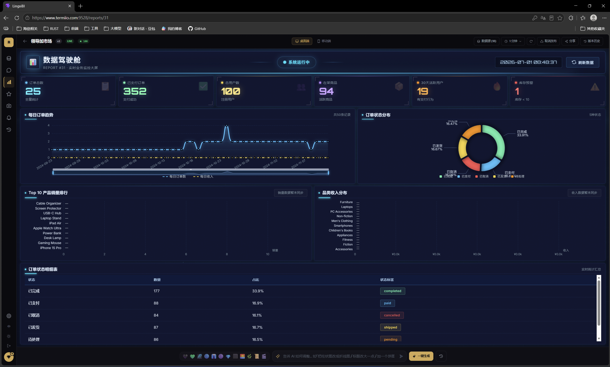
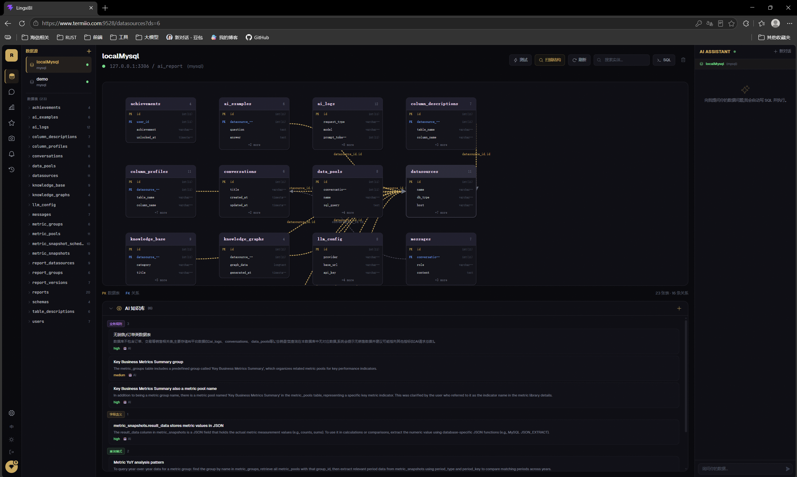
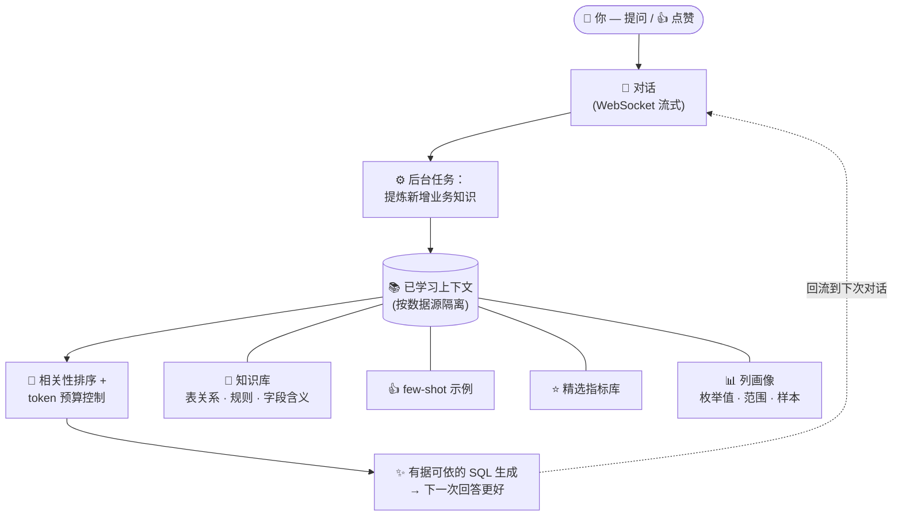
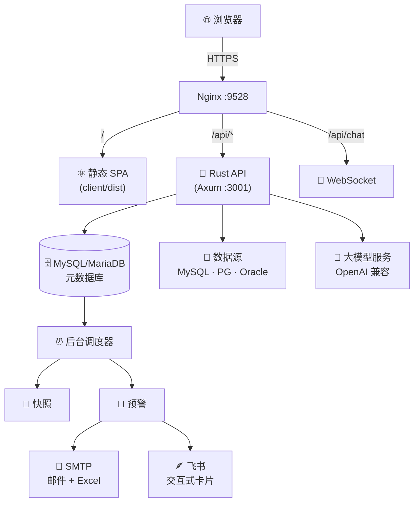

<div align="center">

# 灵犀BI · LingxiBI

**接入数据库，与数据对话，让 AI 为你构建看板。**

*心有灵犀一点通 —— 你和数据之间的默契。*

<br/>

[](LICENSE)
[](https://www.rust-lang.org/)
[](https://react.dev/)
[](#-使用-docker-快速开始推荐)
[](CONTRIBUTING.md)
[](#-功能特性)

<br/>

[🚀 在线体验](#-在线体验) · [⚡ 快速开始](#-使用-docker-快速开始推荐) · [✨ 功能特性](#-功能特性) · [🧠 自学习机制](#-自学习机制) · [🏗️ 架构](#️-架构) · [📦 部署](#-生产环境部署)

<br/>

[English](README.md) · **简体中文**

</div>

---

## 💡 项目简介

**灵犀BI（LingxiBI）** 是一个会自我学习的 BI 平台，能把原始数据库变成可分享、可交互的数据看板 —— 无需手写 SQL，无需搭建传统 BI 工具。

接入 MySQL、PostgreSQL 或 Oracle，然后：

1. **用自然语言提问** —— AI 自动编写并执行只读 SQL
2. **沉淀指标库** —— 让 AI 始终贴合你的业务定义
3. **越用越聪明** —— 每次对话都会把业务规则教给系统
4. **生成 HTML 看板** —— 通过对话持续优化，完整版本历史可回滚
5. **及时获知变化** —— 阈值预警通过邮件（附带 Excel）和/或飞书卡片推送

<br/>

<div align="center">
  
  <br/><sub>▲ AI 一键生成的可交互数据看板（ECharts）</sub>
</div>

<br/>

<div align="center">
  
  <br/><sub>▲ 用自然语言与数据源对话</sub>
</div>

---

## 🚀 在线体验

<table>
  <tr><td>🌐 <b>网址</b></td><td><a href="https://www.termiio.com:9528">https://www.termiio.com:9528</a></td></tr>
  <tr><td>👤 <b>用户名</b></td><td><code>admin</code></td></tr>
  <tr><td>🔑 <b>密码</b></td><td><code>admin123</code></td></tr>
</table>

> ⚠️ 公开共享演示环境 —— 请勿录入真实凭据或敏感数据，数据可能被定期重置。

---

## ✨ 功能特性

| | 能力 | 说明 |
|---|---|---|
| 🔌 | **多源接入** | MySQL · PostgreSQL · Oracle —— 自动解析表结构，可视化表间关系为知识图谱 |
| 💬 | **AI 对话** | 自然语言 → 只读 SQL，自动修复失败查询，服务端流式生成（切走页面也不中断） |
| ⭐ | **指标库** | 验证过的命名业务指标 —— 同时作为 AI 知识库 |
| 📊 | **AI 看板** | 一句话生成响应式 ECharts HTML 看板，对话式迭代，版本历史 + 回滚 |
| 🎨 | **收藏主题** | 把报表的视觉风格（配色、排版、图表样式）存为可复用主题，一键用该风格生成新看板 |
| 🧠 | **自学习** | 自动提炼按数据源隔离的业务知识；👍 转 few-shot 示例；相关性排序召回 |
| 📸 | **快照** | 定时采集指标快照，支持趋势/同比/环比分析 |
| 🔔 | **多渠道预警** | 阈值规则 → AI 撰写的邮件（附 Excel）和/或飞书交互卡片（HMAC-SHA256 加签） |
| 🔗 | **分享** | 不可猜测的分享链接，支持发布/草稿控制 |
| 🌍 | **国际化** | 内置中英文界面 |
| 🔐 | **安全** | JWT 认证、登录限流、SQL 白名单校验、SSRF 防护、安全响应头 |

---

## 🧠 自学习机制

大多数 text-to-SQL 工具是无状态的——问完即忘。灵犀BI 则会**不断沉淀按数据源隔离的业务知识**，并回流到每一次回答里。团队用得越多，它就越准。



**核心机制：**

- **自动抽取** —— 每轮对话后，LLM 只提炼新增知识（与已知去重，带置信度）
- **人在回路** —— 对好的回答点 👍，存为下次模型会遵循的 few-shot 示例
- **精选指标** —— 经过验证的命名 SQL，作为高可信的可复用定义
- **智能召回** —— 按关键词相关性 × 置信度排序，限制在 token 预算内

---

## 🛠️ 技术栈

| 层 | 技术 |
|-------|------------|
| 🦀 **后端** | Rust · [Axum](https://github.com/tokio-rs/axum) · [SQLx](https://github.com/launchbadge/sqlx) · [Tokio](https://tokio.rs/) |
| 🗄️ **元数据库** | MySQL / MariaDB |
| 🎯 **数据源** | MySQL · PostgreSQL · Oracle |
| 🤖 **大模型** | 任意 OpenAI 兼容 API（DeepSeek、GPT-4o、Qwen 等） |
| 📧 **投递** | SMTP ([lettre](https://github.com/lettre/lettre)) · Excel ([rust_xlsxwriter](https://github.com/jmcnamara/rust_xlsxwriter)) · 飞书 webhook (HMAC-SHA256) |
| ⚛️ **前端** | React 19 · Vite · TypeScript · Tailwind CSS · Zustand · React Router |

---

## 🏗️ 架构



**设计原则：**

- **无状态 API** —— 只有元数据库持有状态，水平扩展友好
- **原子调度** —— 后台任务原子领取，多实例安全
- **多渠道投递** —— 每条规则可选邮件、飞书或两者同时；各渠道结果独立记录
- **安全优先** —— SQL 白名单校验、Webhook SSRF 防护、bcrypt-12、安全响应头

---

## ⚡ 使用 Docker 快速开始（推荐）

```bash
docker compose up -d --build
```

打开 **http://localhost:9528** → 创建首个管理员账户，即可使用。

| 服务 | 角色 |
|---------|------|
| `db` | MySQL 元数据存储（仅内部访问） |
| `server` | Rust API `:3001`（首次启动自动生成 JWT_SECRET） |
| `web` | Nginx `:9528` —— SPA + API 代理（含 WebSocket） |

```bash
docker compose logs -f server     # 跟踪 API 日志
docker compose down               # 停止（保留数据）
docker compose down -v            # 停止并清除所有数据
```

> 🛡️ **生产环境：** 在 `.env` 中设置强密码，`CORS_ALLOWED_ORIGIN` 改为真实域名，并在上游做 TLS 终止。

---

## 💻 本地开发

<details>
<summary><b>前置依赖</b></summary>

- [Rust](https://rustup.rs/)（stable）
- [Node.js](https://nodejs.org/) ≥ 18
- MySQL 或 MariaDB

</details>

```bash
# 1. 创建元数据库
mysql -e "CREATE DATABASE ai_report CHARACTER SET utf8mb4 COLLATE utf8mb4_unicode_ci;"

# 2. 启动后端
cd server
cp .env.example .env   # 编辑 DATABASE_URL + JWT_SECRET
cargo run              # 自动执行迁移，监听 :3001

# 3. 启动前端
cd client
npm install && npm run dev   # Vite 代理 /api → :3001
```

打开终端输出的地址，创建管理员，添加数据源，在**设置**中配置大模型。

---

## ⚙️ 配置

| 变量 | 说明 |
|----------|-------------|
| `DATABASE_URL` | 元数据库连接串 |
| `JWT_SECRET` | Token 签名密钥（≥ 16 字符） |
| `CORS_ALLOWED_ORIGIN` | 允许的来源（开发用 `*`） |

> 大模型、SMTP、飞书 Webhook 均在应用内运行时配置（存储在数据库，非环境变量）。

---

## 📦 生产环境部署

```bash
# 服务器一次性初始化（Rust、MySQL、Nginx、TLS）：
bash scripts/setup-server.sh [domain]

# 从本地发布：
./scripts/deploy.sh user@host [domain]
```

Rust 二进制在目标主机编译（避免 glibc 不匹配）。SPA 在本地构建后作为静态文件部署。

> 💡 Docker Compose 方案同样可用于生产环境，部署在 TLS 代理之后。

---

## 🗂️ 项目结构

```
lingxibi/
├── client/                  React + Vite SPA
│   └── src/
│       ├── pages/           路由级页面
│       ├── components/      通用 UI 组件
│       ├── stores/          Zustand 状态管理
│       ├── lib/             API 客户端与类型
│       └── i18n/            中英文翻译
├── server/                  Rust (Axum) API
│   ├── src/
│   │   ├── routes/          HTTP + WebSocket 处理器
│   │   ├── llm/             大模型客户端 + 提示工程
│   │   ├── alert_engine.rs  预警评估 + 多渠道投递
│   │   ├── feishu.rs        飞书 Webhook + HMAC 加签
│   │   ├── email.rs         SMTP 邮件发送
│   │   └── ...
│   └── migrations/          SQL 迁移（自动执行）
├── scripts/                 部署自动化
├── docker-compose.yml       一条命令拉起全栈
└── .env.example             环境变量模板
```

---

## 🔒 安全

| 层面 | 机制 |
|------|------|
| **认证** | JWT 会话、bcrypt-12、登录限流（5 次失败 / 5 分钟锁定） |
| **SQL 安全** | 词法白名单校验（仅允许 SELECT/SHOW/DESCRIBE/EXPLAIN/CTE）、单查询超时 30s、行数上限 50k |
| **SSRF 防护** | 飞书 Webhook URL 限制为官方域名 |
| **响应头** | `X-Content-Type-Options`、`Referrer-Policy`、`Permissions-Policy` |
| **凭据保护** | API 永远不返回密钥/密码；响应中始终掩码 |

> 📣 安全漏洞请私信 **[macrogroot@outlook.com](mailto:macrogroot@outlook.com)**，不要公开提交 issue。

---

## 🗺️ 路线图

- [ ] 基于 embedding 的语义检索（知识库与示例）
- [ ] 飞书多维表格（Bitable）同步
- [ ] 更多通知渠道（钉钉、企业微信、Slack）
- [ ] 凭据静态加密
- [ ] 多架构 Docker 镜像（GHCR）
- [ ] `SECURITY.md` + `CHANGELOG.md`
- [ ] 更多图表类型与看板模板

---

## 🤝 参与贡献

欢迎贡献！请阅读 [CONTRIBUTING.md](CONTRIBUTING.md) 了解开发流程和规范。

## 📬 联系方式

- 📧 [macrogroot@outlook.com](mailto:macrogroot@outlook.com)
- 🐛 [提交 Issue](../../issues)

## 📄 许可证

[MIT License](LICENSE) © 2026 Macro

<div align="center">
<br/>
<sub>用 🦀 Rust 与 ⚛️ React 构建 · Powered by AI · Ethan</sub>
</div>
